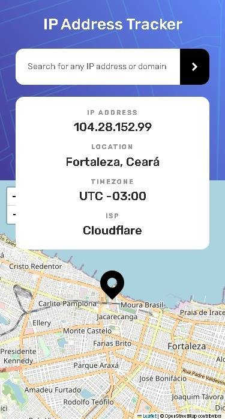
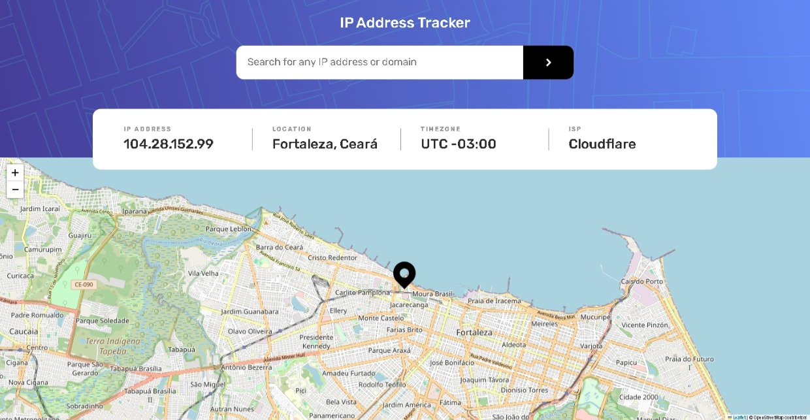
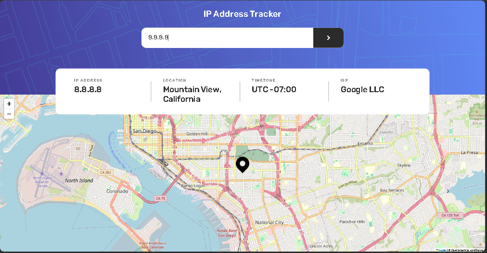

# Frontend Mentor - IP address tracker

This is a solution to the [ip-address-tracker-master on Frontend Mentor](https://github.com/gillaercio/ip-address-tracker-master). Frontend Mentor challenges help you improve your coding skills by building realistic projects

## Table of contents

- [Overview](#overview)
  - [Screenshot](#screenshot)
  - [Links](#links)
- [My process](#my-process)
  - [Built with](#built-with)
  - [What I learned](#what-i-learned)
  - [Continued development](#continued-development)
- [Author](#author)

## Overview

### Screenshot

These are my screenshots showing how the project turned out.

- Mobile design:



- Desktop design:



- Active states:



### Links

- Solution URL: [My Solution](https://github.com/gillaercio/ip-address-tracker-master)

## My process

### Built with

- Semantic HTML5 markup
- CSS custom properties
- Flexbox
- CSS Grid
- Mobile-first workflow
- JavaScript

### What I learned

I took advantage of this project to practice using **BEM** with HTML, **Reset CSS** and  **Variables** with **CSS** and **DOM** and **REGEX** with **JavaScript**:

BEM (Block Element Modifier)

```html
<section class="header__infos" aria-labelledby="info-heading">
  <h2 id="info-heading" class="visually-hidden">IP information</h2>
  <div class="header__info">
    <h3 class="header__info-title">IP Address</h3>
    <p class="header__info-value" id="ip">--</p>
  </div>

  <div class="header__info">
    <h3 class="header__info-title">Location</h3>
    <p class="header__info-value" id="location">--</p>
  </div>

  <div class="header__info">
    <h3 class="header__info-title">Timezone</h3>
    <p class="header__info-value" id="timezone">--</p>
  </div>

  <div class="header__info">
    <h3 class="header__info-title">ISP</h3>
    <p class="header__info-value" id="isp">--</p>
  </div>
</section>
```

Reset CSS

```css
*,
*::before,
*::after {
  margin: 0;
  padding: 0;
  box-sizing: border-box;
}
```

Variables

```css
:root {
  --Gray-950: hsl(0, 0%, 17%);
  --Gray-400: hsl(0, 0%, 58%);
  --White: hsl(0, 0%, 100%);
  --Black: hsl(0, 0%, 0%);

  --rubik: 'Rubik', sans-serif;

  --text-info: 700 1.1rem/120% var(--rubik);
  --text-input: 1.4rem/120% var(--rubik);
  --text-input-desktop: 1.8rem/120% var(--rubik);
  --text-base: 500 2rem/120% var(--rubik);
  --text-h1: 500 2.6rem/120% var(--rubik);
}
```

REGEX

```js
function isIP(value) {
  const ipRegex = /^(25[0-5]|2[0-4]\d|1\d\d|[1-9]?\d)(\.(25[0-5]|2[0-4]\d|1\d\d|[1-9]?\d)){3}$/;

  return ipRegex.test(value);
}
```

DOM

```js
// ...
form.addEventListener("submit", (e) => {
  e.preventDefault();

  const value = input.value.trim();

  if (!value) return;

  fetchIPData(value);
  input.value = "";
});

fetchIPData();
```

### Continued development

I would like to improve the use of the **HTML**, **CSS** and **JavaScript**.

## Author

- Frontend Mentor - [@gillaercio](https://www.frontendmentor.io/profile/gillaercio)
- Github - [My Github](https://github.com/gillaercio)
- LinkedIn - [My LinkedIn](https://www.linkedin.com/in/gildman-la%C3%A9rcio/)